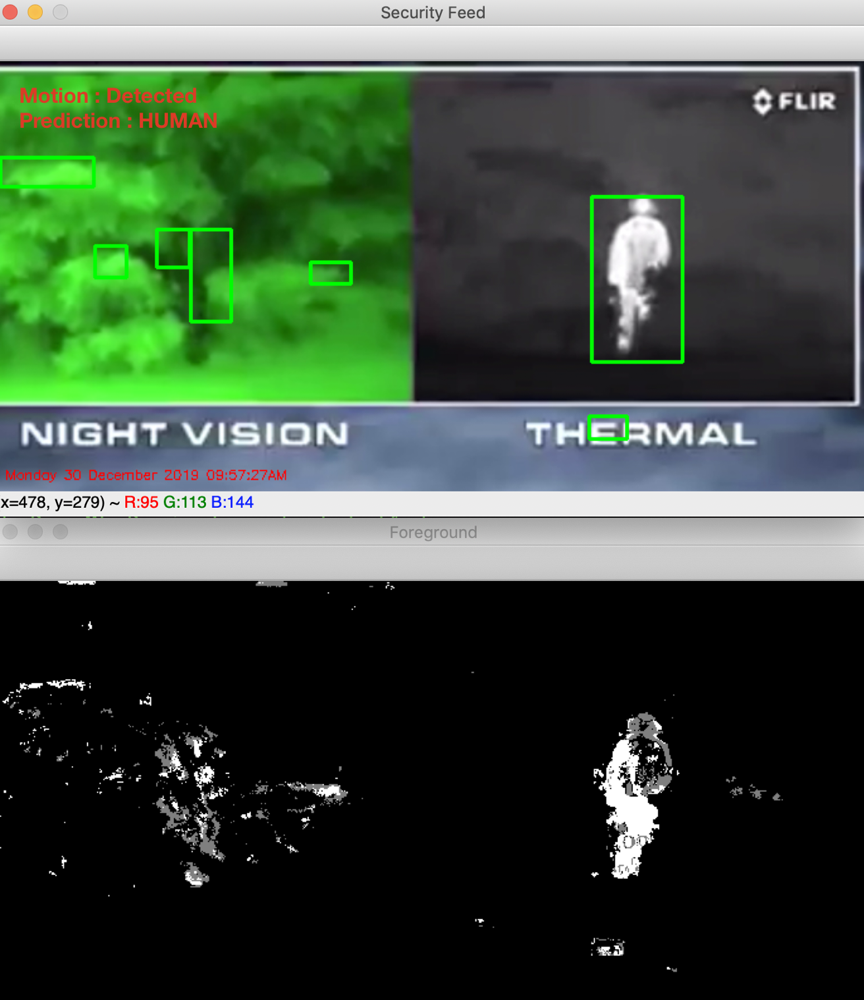
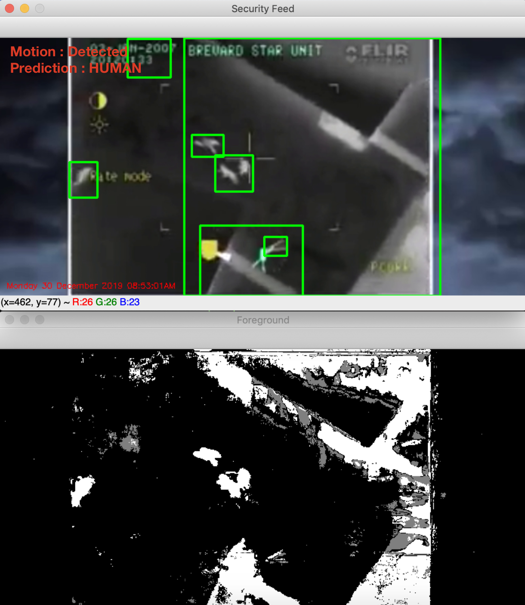

# CNN-Keras-TF-Surveillance-System
Detect motion for input video source using background subtraction algorithm. Then dynamically extract the images from the video source as test images. This images are fed to trained model "64x3-CNN.model" to predict if the motion is caused by Humans or not. Then display alert message on Security feed.

# Output

## Night Vision vs Thermal:
Object under observation is behind bushes

Objects viewed from sky

                                 
## Background Subtraction:

## Frame Dialation:

## Final Security Feed:

